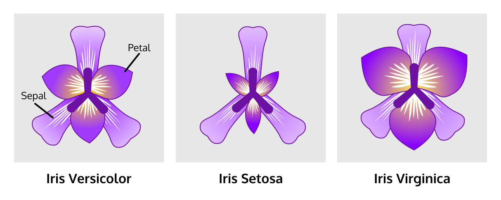

# K-Means Clustering on Iris Dataset
The purpose of this project is to perform exploratory data analysis and K-Means Clustering on the Iris Dataset.

The Iris data set contains 3 classes of 50 instances each, where each class refers to a specie of the iris plant.  One class is linearly separable from the other 2; the latter are not linearly separable from each other. Along with the three different species (Iris setosa, Iris virginica, and Iris versicolor), it has four features measured for each sample: the sepal length and width, and the petal length and width. Since clustering is normally performed on unsupervised data, the dataframe I used for clustering in this project contains only the feature data for the samples and not their species. I later use the species data to evaluate the clusters’ accuracy.    
*For full dataset description look at iris.names file:* [Iris.names](https://github.com/hirwaishimwe/Iris_KMeans_Clustering/blob/main/iris.names)

Flower Specie Image (Versicolor, Setosa, Virginica):

## The Code and Implementation: [Iris_K_Means.ipynb](Iris_K_Means.ipynb)
I use Python and Jupyter notebook.

I use the following Python libraries:
- Pandas for data manipulation,
- Seaborn and matplotlib for data visualization, 
- Scikit-learn (sklearn) for machine learning.

## The Process 
1. Set up
2. Explotary Data Analysis
3. Find the optimal number of clusters (k)
4. Fit the K-Means model to the data
5. Visualize the predicted clusters
6. Evaluate the model 
  
### Set up 
- Import the necessary libraries.
- Load the Iris dataset from sklearn's built-in datasets. 
   - Iris from sklearn comes with a bunch of different information (not just the data)
   - It comes with target values. The target values indicate which cluster/specie each flower belongs to.
- Print the dataset descriptions.
- Create a dataframe from the iris data

### Exploratory data analysis
- Use the head method to see the top of the dataframe.
- Use the describe method on the dataframe to get a summary of the data.
  - This will give us the count, mean, standard deviation, minimum, and maximum values for each of the columns in the dataset.
- Use the seaborn library to visualize the data. 
  - Use the pairplot function to create a scatterplot matrix, which will show the relationship between each pair of columns in the dataset.
  - Use the violinplot function to show the distribution of data across multiple dimensions.
  - Use the boxplot function to create a boxplot for each of the columns in the dataset, which can help us identify any outliers in the data.
  - Use the heatmap function to create a heatmap of the correlations between the columns in the dataset. This can help us identify which columns are most strongly correlated with each other.
  
### Find the optimal number of clusters (k)
- Determine the optimal number of clusters (k) using the elbow method

### Fit the K-Means model
- Fit the K-Means model to the data with k clusters

### Visualize predicted clusters
- Add the predicted cluster labels to the dataframe
- Create a pairplot of the data with the predicted clusters, this will show use the distribution of the clusters

### Evaluate the model
- Make and compare a pairplot of the actual species/clusters to the pairplot of the predicted clusters
  - Make a dataframe with the iris data with their species
  - Create a scatter plot of the dataframe with the data and actual species
  - compare this pairplot to the earlier pairplot of the predicted clusters, this will visual show us the performaces of the model
- Use crosstabulation
  - Add a column with the predicted values(cluster labels) and a column with the target values(iris species) to a dataframe, 
  - Crosstabulated those columns.
    - The first column in the crosstab has the cluster labels. The second to fourth columns have the Iris species that are clustered into each of the labels.

